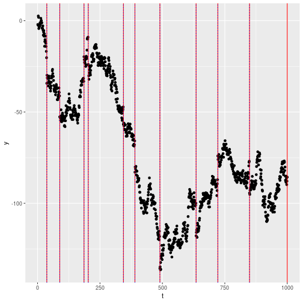
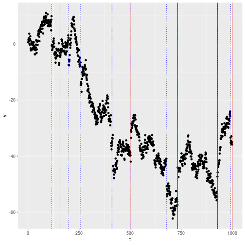

## Installation and Requirements

### Installing the package

To install the package from Github:


```r
# devtools::install_github("PATHTOREPO/l2FPOP")
library(l2FPOP)
```


Alternatively one could fork this repository, and:


```r
# devtools::install_github("PATHTOFOLDER/l2FPOP")
library(l2FPOP)
```


### Requirements for the installation

The packages requires `Rcpp` with compiler support for the `std` library introduced with `g++11`.


### Bugs and further queries

If any bug should be spotted, or for any information regarding this package, please email the package mantainer: `g` dot `romano` at `lancaster.ac.uk`.

## Introduction

`l2-fpop` is a `c++` implementation for `R` of the l2-fpop algorithm for performing optimal multiple changepoint detection on some ill-conditioned problems such as detecting a change in mean of the distribution of a Random Walk or on a AR Model for a stream of univariate data.

The main recursion is a variation from the 2005 algorithm Functional Pruning Optimal Partitioning. Let  a series of observations centered on the data generating process  with underlying signal  where we have no change if  and a change otherwise, and finally let  be a a general statistical loss function, then, l2-fpop finds the optimal solution to the problem:

<p align="center"></p>

This is solved via dynamical programming based on the recursion:

<p align="center"></p>

where

<p align="center"></p>

It will follow an example based on the Random Walk.

### Random Walk

One of the cases on which our algorithm can be applied is the Random Walk, also known as standard Brownian motion or Wiener Process. Let  be a random vector build in the following way:

<p align="center"></p>
with

<p align="center"></p>

where  and . Then we find a changepoint if . On this framework, our minimization becomes the following:

<p align="center"></p>

Where our .

# Quick Start

This demo shows some of the features present in the `l2FPOP` package.

Three functions at the moment are present in the package:


|functions          |description                                                              |
|:------------------|:------------------------------------------------------------------------|
|l2fpop             |Main function to run the l2-FPOP algorithm on a sequence of observations |
|dataRW             |Generate a realization of a RW process plus noise                        |
|estimateParameters |Estimate the parameters sigma_x, sigma_y of a RW                         |

At the moment only two functions for data generation and parameter estimation are present, and they all are tailored for the Random Walk. Since l2-FPOP can tackle also other Stochastic Processes, more functions are expected to be added.

### The `l2-fpop` function

The `l2-fpop` function takes as input the following arguments:

- `y`: the sequence of observations we want to run the algorithm on;
- `l0penalty`: the penalty for the l0 norm in our minimization (what is commonly known as `beta` in the litterature);
- `l2penalty`: the penalty for the l2 norm;
- `type`: the type of costraint to apply to the recursion. At the moment only the standard change ("std") and the isotonic regression ("isotonic") are implemented.

### A simple Random Walk example

We will start generating a Random Walk. The function `dataRW` takes in:

- the length of the sequence of observations,
- a poisson parameter regulating the probability of seeing a jump,
- the average magnitude of a change,
- the  and the .


```r
set.seed(42)
Y = dataRW(n = 1e3, poisParam = 0.01, meanGap = 20, sdX = 1, sdY = 1)
y = Y\lambda_1\lambda_2\lambda_1 = 2 \ \sigma_y^2 \ log(n)\lambda_2 = \frac{\sigma_y^2}{\sigma_x^2}\sigma_yy

res = l2fpop(y, l0penalty = 2 * (3^2) * log(length(y)), l2penalty = (3^2) / 1)
```

We plot again the results:



### Isotonic regression

This implementation can also perfom isotonic regression case. Using a different constraint function (), we are now able to pick only up changes. We change the parameter (type) which defines the type of constraint we're using.


```r
set.seed(43)

Y = dataRW(n = 1e3, poisParam = 0.01, meanGap = 10, sdX = 1, sdY = 1)
y = Ychangepoints, color = 2) +
  geom_vline(xintercept = Y$cp, col = 4,  lty = 3)
```



## Contributing to this package

If you have interest to contribute to this package, please do not esitate to contact the maintainer:  `g` dot `romano` at `lancaster.ac.uk`.
