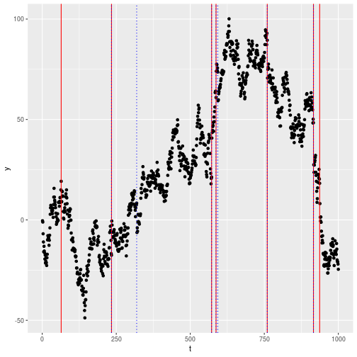
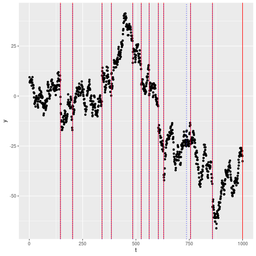

## Installation and Requirements

### Installing the package

To install the package from Github: 


```r
# devtools::install_github("gtromano/DeCAFS")
library(DeCAFS)
```


Alternatively one could fork this repository, and: 


```r
# install.packages("DeCAFS", repos = NULL, type = "source")
library(DeCAFS)
```


### Requirements for the installation

The packages requires `Rcpp` with compiler support for the `std` library with the `g++14` standard.


### Bugs and further queries

If any bug should be spotted, or for any information regarding this package, please email the package mantainer: `g` dot `romano` at `lancaster.ac.uk`.

## Introduction

`l2-fpop` is a `c++` implementation for `R` of the l2-fpop algorithm for performing optimal multiple changepoint detection on some ill-conditioned problems such as detecting a change in mean of the distribution of a Random Walk or on a AR process or both for a stream of univariate data.


### The model

We model a combination of a radom walk process (also known as standard Brownian motion or Wiener Process) and an AR process. 
Let  be a random vectorm then for , 


<p align="center"></p>

where

<p align="center"></p>
and 
<p align="center"></p>

Then, DeCAFS solves the following minimization problem: 

<p align="center"></p>

Where our ,  and  is an indicator function..

# Quick Start

This demo shows some of the features present in the `DeCAFS` package. 

Three functions at the moment are present in the package:


|functions          |description                                                              |
|:------------------|:------------------------------------------------------------------------|
|DeCAFS             |Main function to run the l2-FPOP algorithm on a sequence of observations |
|dataRWAR           |Generate a realization of a RW+AR process                                |
|estimateParameters |Estimate the parameters of our model                                     |

At the moment only two functions for data generation and parameter estimation are present, and they all are tailored for the Random Walk. Since l2-FPOP can tackle also other Stochastic Processes, more functions are expected to be added.

### The `l2-fpop` function

The `l2-fpop` function can take as input the following arguments:

- `y`: the sequence of observations we want to run the algorithm on;
- `beta`: the penalty for the l0 norm in our minimization;
- `lambda`: the penalty for the first l2 norm;
- `gamma`: the penalty for the second l2 norm;
- `type`: the type of costraint to apply to the recursion. At the moment only the standard change ("std") is implemented.

In case no argument is provvided, it will procede via robust estimation of the necessary.

### A simple example

We will start generating a Random Walk. The function `dataRWAR` takes in:

- the length of the sequence of observations,
- a poisson parameter regulating the probability of seeing a jump,
- the average magnitude of a change,
- the  and the  parameters,
- the autocorrelation parameter .


```r
set.seed(42)
Y = dataRWAR(n = 1e3, poisParam = .01, meanGap = 15, phi = .5, sdEta = 3, sdNu = 1)
y = Y[["y"]]
```

Running l2-FPOP is fairly straightforward:


```r
res = DeCAFS(y)
```


We can plot the DeCAFS segmentation (red lines), alongside with our real segmentation (dotted blue lines).




## Running the algorithm without estimation
Alternatively, we can also pass all the required parameters in order for it to run.
In this case, since we both have an AR and RW component, we will use  and .


```r
res = DeCAFS(y,  beta = 2 * log(length(y)), lambda = 1/(3^2), gamma = 1/(1)^2, phi = 0.5)
```


### Extreme case: Random Walk

Let's say we now have the . In this case our model simply becomes a random walk plus noise:

<p align="center"></p>

Our Algorithm is capable of dealing with this extreme situation:


```r
set.seed(44)
Y = dataRWAR(n = 1e3, poisParam = .01, meanGap = 15, phi = 0, sdEta = 2, sdNu = 1)
y = Y[["y"]]

res = DeCAFS(y,  beta = 2 * log(length(y)), lambda = 1/(2^2), gamma = 1/(1)^2, phi = 0)
```

which leads to the result:


### Extreme case: Autoregressive model

Secondly, let's say that the  In this case we end up with an Autoregressive model with jumpes of the form:

<p align="center"></p>
where, again .

In this case we need to set , and for :


```r
set.seed(46)
Y = dataRWAR(n = 1e3, poisParam = .01, meanGap = 10, phi = .98, sdEta = 0, sdNu = 2)
y = Y[["y"]]

res = DeCAFS(y,  beta = 2 * log(length(y)), lambda = 0, gamma = 1/(2)^2, phi = .98)
```

which leads to the result:



we see that in this case we miss one changepoint.

## Contributing to this package

If you have interest to contribute to this package, please do not esitate to contact the maintainer:  `g` dot `romano` at `lancaster.ac.uk`.
